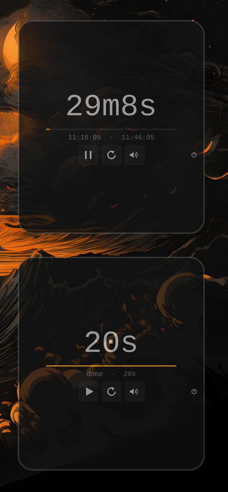

# omatimer

A native Qt6 countdown timer for Omarchy. One binary, no runtime.



Watch it in action: [video on r/omarchy](https://www.reddit.com/r/omarchy/comments/1x1pvyo/i_made_omasettings_to_change_window_appearance/).

## Install

```sh
git clone https://github.com/isjake/omatimer.git
cd omatimer && ./install.sh
```

It installs any missing build tools (`qt6-base`, `base-devel`; asks for your
password only then), builds the app, and puts it in your app launcher. Nothing
goes outside your home folder. `./install.sh --remove` uninstalls;
`./install.sh --link` links to the build in this folder instead of copying it,
so `make` updates the installed app (handy while working on it).

There's no AUR package: AUR registration is closed until further notice,
so omatimer couldn't be published there. The `aur/` folder holds a ready
recipe for when it reopens.

To update later, pull and run the installer again:

```sh
cd omatimer && git pull && ./install.sh
```

Sounds play with `pw-play` from `pipewire` (or `paplay`). The timer makes its
own default sounds, and carries a copy of the freedesktop sound theme in
`sounds/` for the rest, so nothing else needs installing.

## Build by hand

```sh
qmake6 omatimer.pro -o Makefile
make -j$(nproc)
./omatimer
```

## Use

```sh
omatimer              # opens with the last duration you used
omatimer 25m          # opens preloaded with 25 minutes
omatimer 1h30m --start   # opens and starts counting immediately
```

Durations accept plain seconds (`90`) or units (`1h 30m 10s`, `1.5m`), and
the display counts down in the same notation — `1h5m30s`, `2m`, `45s` — so
whatever is on screen can be typed straight back in. Anything under a minute
shows as plain seconds. The number shrinks to fit when the units make it long.

| Key | Action |
|-----|--------|
| Enter / Space | start or stop |
| R | reset to the saved duration |
| Ctrl+M | mute (also the speaker button, next to reset) |
| ? / F1 | show or hide the shortcuts and the volume slider (also the ? button, bottom right) |

Shortcuts are case-insensitive and work while the duration box has focus;
`h`, `m`, `s`, digits and `.` still type normally, which is why mute moved to
Ctrl+M (a plain `m` is part of `25m`).

## Volume

Sounds play at 20% of the system volume by default. Mute (Ctrl+M or the
speaker button) is remembered too, so a new timer opens muted if the last one
was. The slider in the help
window (`?`) changes that; it's saved straight away and shared by every open
timer. It sets the sound's own volume, so it still follows the system volume.

## Sounds

The help window (`?`) also picks the **button sound** and the **done sound**.
The defaults are built in (*chime* when done, *click* for buttons, plus *bell*),
made by the timer itself, so they work everywhere. The rest are the freedesktop
sound theme, grouped as good-for-timers and other system sounds, or None. The
system's copy (`/usr/share/sounds/freedesktop/stereo/`) is used when installed,
otherwise the copy in `sounds/freedesktop/`. **That copy is not MIT**: the
files keep their own GPL / LGPL / Creative Commons licenses, listed in
`sounds/freedesktop/CREDITS`. Picking one plays a preview.
Both are saved as soon as they change.

The **font** always matches the system: fontconfig's `monospace`, the font
`omarchy font set` changes. Open timers switch to a new system font straight
away, no restart needed.

## Colors

Colors come from the current Omarchy theme
(`~/.local/state/omarchy/current/theme/colors.toml`), the same file omacalc
and omawrite read, and re-tint live when you switch themes. The theme gives
one background/foreground pair; a light theme uses it turned inside out, so the
light background stays in the theme's palette rather than flat white.

Light and dark follow the theme's own `mode`, so switching to a light Omarchy
theme switches the timer with it, live and without a restart. There's no manual
light/dark toggle.

The window is painted opaque and keeps Omarchy's `default-opacity` tag, so
transparency is the compositor's job and Super+Alt+Backspace toggles this
window along with everything else.

## License

MIT. See [LICENSE](LICENSE). The sounds in `sounds/freedesktop/` are not
covered by it; see that folder's README.
